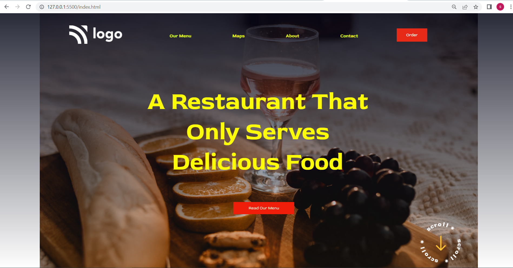

# Project 2

## Project 2 [Live Link]()

-   Skills Gained in this project
    -   Learned to use pseudo classes and CSS Position.

---

## Time taken to finish this project

-   8 hour taken to complete it.

#### Screenshot

